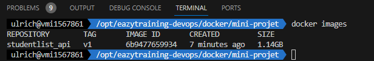
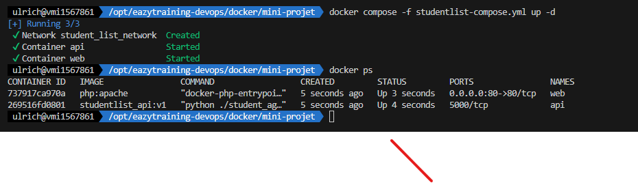
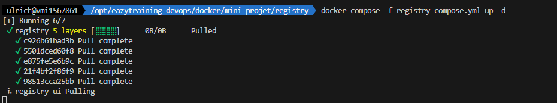
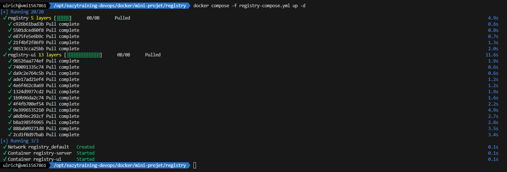
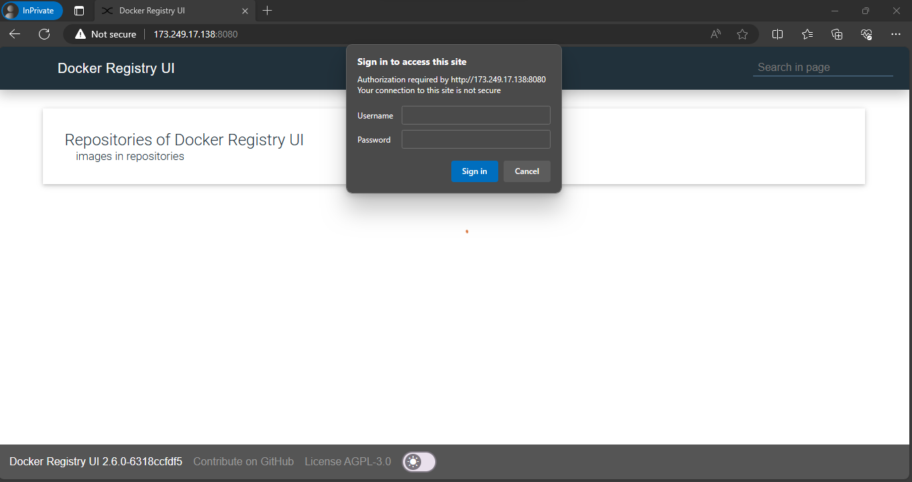
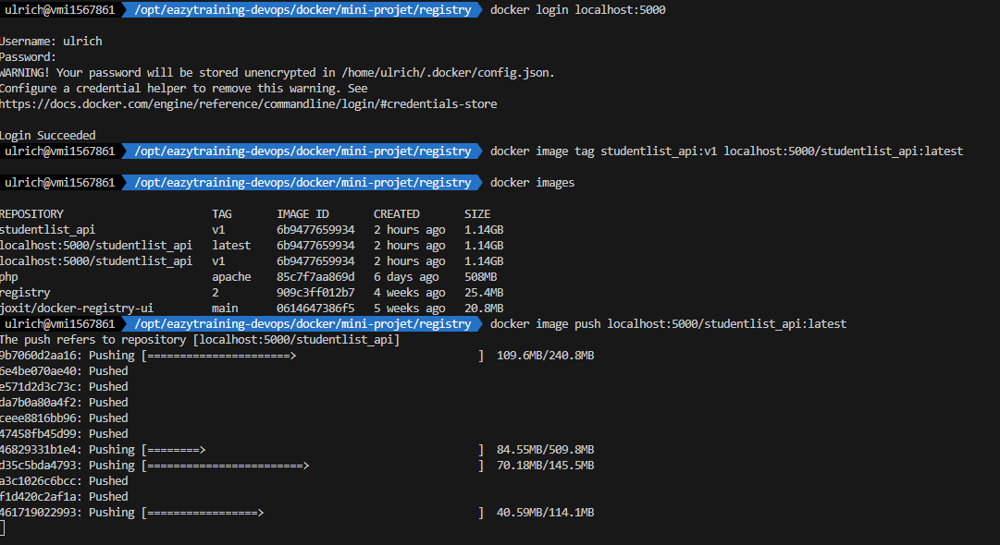
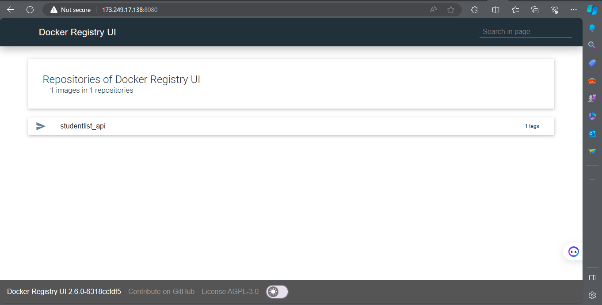

# Mini Projet Docker 
# Lien vers les consignes du projet: [ici](https://github.com/diranetafen/student-list.git "ici")

# Lien vers le cours: [ici](https://eazytraining.fr/cours/introduction-a-docker/ "ici")

 


-------------------
Prenom : Ulrich
Nom : NOUMSI
linkedIn: https://www.linkedin.com/in/ulrich-steve-noumsi/


## Application
Le mini projet Docker proposer par Eazytraining est un projet qui nous permet de mettre en pratique les differentes notions 
qui ont ete aborde durant la formation sur la plateforme.

L'application que nous devons mettre en up and running est une application plutot basique de gestion des etudiants qui nous permettra
d'afficher une simple liste d'etudiants avec leur âge une fois le deploiement finaliser.

l'application se nomme "student_list et comporte deux modules:
- un module API REST qui envoie la liste des étudiants à afficher en se basant sur un fichier JSON qui nous a été fourni
- un module qui est constitué d'une application web , qui permettra a l'utilisateur d'obtenir la liste des etudiants via un navigateur 

NB: 
- Le module API REST nécessite une authentification
- Les differents langages de programmation sont : Le Python, le HTML & PHP

## Le Besoin
L'enonce ou la presentation du mini projet Docker nous demande de realiser un certains nombre de taches:
- construire des conteneurs pour chacun de nos modules
- interconnecter nos conteneurs
- fournir un registre privé
- fournir le code final

## Resolution
- Présentation des differents fichiers qui sont present dans notre projet et leur role
- Installation et configuration de l'environnement de travail
- Construction de l'images et test
- Realisation du Deploiement & presentation du mode deploiement choisi


### Composants du projet
Nous avons comme fichier:

- docker-compose.yml : pour lancer l'application (API et application web)
- student_age.py : contient le code source de l'API en python
- Dockerfile : pour construire l'image de l'API avec le code source à l'intérieur
- student_age.json : contient le nom et l'âge des étudiants au format JSON
- index.php : page PHP où l'utilisateur final se connectera pour interagir avec le service et lister les étudiants avec leur âge.

NB: Les fichiers que nous venons de presenter sont les fichiers de bases qui se retrouvent dans le miniprojet avec une structure nous permettant de mieux organiser notre travail
- Le dossier simple_api : contient le module API REST student_age.py && le fichier student_age.json
- le dossier website : contient notre module web index.php

#### Ajout
En plus des fichiers qui se trouvent dans le projet pour nous fournir un exemple d'organisation , dans notre rendu nous aurons
d'autres fichiers:
- un docker-compose pour le deploiement d'un registry : registry-compose.yml
- un fichier readme en francais 
- un fichier readme en anglais
- un fichier script pour la configuration de notre environnement : env_config.sh

## Installation et configuration de l'environnement
### Prerequis
- Cloner le projet
- Pour le cloud il faut disposer d'un compte aws/azure/gcp et de terraform installer en local
- Pour une machine en local il suffit juste d'avoir vagrant & virtualBox d'installer
    virtualbox: [ici](https://www.virtualbox.org/wiki/Downloads "ici")
    vagrant: [ici](https://developer.hashicorp.com/vagrant/install?product_intent=vagrant "ici")
    terraform: [ici](https://developer.hashicorp.com/terraform/install "ici")

#### aws/azure/gcp
Lancer la creation d'une instance EC2 en recuperant le script contenu dans le dossier provisionning/terraform

#### Local
recuperer le script qui se trouve dans le dossier provisionning/local

#### Plateforme Online
- Play with Docker : [ici](https://labs.play-with-docker.com/ "ici")
- Docker Labs Build by Eazytraining : [ici](https://docker.labs.eazytraining.fr/ "ici")


## Construction && test de l'image
NB: Suivre les differentes etapes qui se trouve dans le depot du mini projet docker
afin de construire le fichier ***Dockerfile***

### Construction
Une fois que le fichier le Dockerfile finaliser, realiser les etapes suivantes:
```bash
docker build . -t studentlist_api:v1
docker images
```
Notre image est bien presente

### Test de l'image
#### Demarrage du conteneur
il suffit juste de lancer notre image 
```bash
docker run -d --name api -v ./student_age.json:/data/student_age.json studentlist_api:v1
docker ps
```

Comme nous pouvons le remarquer le conteneur est bien demarrer ce qui voudrait dire que notre image est bien fonctionnelle
et si nous regarder au noveau de la colonne du ***PORT*** nous verrons que le port 5000 est bien le port que nous avons exposer 
lors de la construction de l'image , et ce port sera le port sur lequel le frontend (module web) viendra deposer ces requêtes.

Comme notre module API REST a besoin du fichier ***student_age.json*** nous avons du realiser un Bind Mount du repertoire
***simple_api*** pour charger le fichier dans le conteneur lors de son demarrage

#### Ajout du Frontend
L'image etant fonctionnel nous rajoutons le frontend:
La premiere etape consistera a  modifier le module web
Dans le fichier index.php il nous faut modifier une ligne specifique : ` $url = 'http://<api_ip_or_name:port>/api/v1.0/get_student_ages';`
Il nous faut remplacer ***api_ip_or_name*** & ***port*** par les bonnes informations , dans notre cas :
api_ip_or_name : ***api***
port: ***5000***
La commande ci-dessous va nous aider a realiser ce changement:

```bash
sed -i 's\<api_ip_or_name:port>\api:5000\g' ./website/index.php
```
Une fois le changement effectuer , lancons notre conteneur webapp(frontend)
```bash
docker run -dp 80:80  --name webapp -v ./website:/var/www/html php:apache
```

#### Testons le Frontend
- via l'invite de commande: 
option 1: apartir d'un conteneur
```bash
curl -u toto:python -X GET http://api:5000/api/v1.0/get_student_ages
```
option 2: a partir du serveur hote si et seulement si le port d'ecoute externe est ouvert
```bash
curl -u toto:python -X GET http://127.0.0.1:5000/api/v1.0/get_student_ages
```
- Via les plateformes online
Nous ouvrons tout simplement le port 80

- Via l'environnement en Local
option 1:
```bash
curl -X GET localhost:80
```
option 2:
```bash
curl -X GET $IP:80
```
NB: $IP fait reference a l'adresse ip qui sera recupere dynamiquement grace a la commande suivante:
```bash
IP=ip addr show eth0 | grep -Eo 'inet (addr:)?([0-9]*\.){3}[0-9]*' | cut -d ' ' -f 2
```
Option 3:
Ouvrir un navigateur et entrer l'adresse ip accessible depuis l'exterieur
- Pour les environnements aws/azure/gcp recuperer l'adresse IP avec cette commande: 
```bash
ip addr show eth0 | grep -Eo 'inet (addr:)?([0-9]*\.){3}[0-9]*' | cut -d ' ' -f 
```
- Pour les environnements Locals recuperer l'adresse IP avec cette commande:
```bash
ip addr show enps8| grep -Eo 'inet (addr:)?([0-9]*\.){3}[0-9]*' | cut -d ' ' -f 
```

NB: Une fois les tests concluant , il faudra nettoyer l'environnement pour passer a la suite du Mini projet sans avoir d'encombre
```bash
docker stop $(docker ps -aq)
docker rm  $(docker ps -aq)
```

### Mise en place du deploiement
#### iac via docker-compose
Les differents test etant concluant nous allons passer a la mise en place du deploiement en se basant sur le principe de 
IAC pour ***Infrastructure as Code*** qui va nous permettre de deployer notre stack a l'aide d'un fichier 
docker compose et suivant un certains processus via des dependances qui seront introduite.

- Nous allons rediger le fichier ***docker-compose.yml***
- Nous allons lancer le deploiement de notre stack
```bash
docker compose -f docker-compose up -d
```

la declaration de dependances que nous avons introduites ici est le 'depends_on' qui va permettre a docker-compose de choisir l'ordre
de demarrage de nos differents conteneurs et dans notre cas le conteneur API REST sera le premier a etre up avant que celui du web ne se lance.

- Une fois le deploiement terminer nous allons utiliser l'une des methodes presenter precedemment :
Dans notre cas nous allons recuperer l'adresse ip accessible depuis l'exterieur et la metrre dans un
navigateur :


#### Mise en place d'un registre privee
Pour mettre en place notre registre privee nous aurons besoin de :
- l'image registry:2 pour le registre en lui meme 
- l'image joxit/docker-registry-ui:static comme interface utilisateur (UI)
- rediger le fichier docker compose correspondant et le lancer 

NB: Dans le registry-compose nous avons le dossir auth qui contien le fichier htpasswd 
pour charger le contenu de ce fichier nous avons utiliser la commande suivante:
```bash
sudo htpasswd -Bbn  ulrich ulrich > auth/htpasswd
```
Puis nous lancons notre fichier compose
```bash
docker compose -f registry-compose.yml up -d
```




Une fois le registry en deployer , il nous faut verifier sa disponibilitee
- recuperer l'adresse ip et l'entrer dans le navigateur:


Nous avons bien notre registry de fonctionnel 

#### Pousser l'image sur notre registry privee
```bash 
docker login localhost:5000
docker image tag studentlist_api:v1 localhost:5000/student_list:latest
docker images
docker push localhost:5000/student_list:latest
```


Verifions sur le navigateur:



# Conclusion

Tout au long de ce projet , nous avons eu a mettre en place le build d'une image personnalisee, configurer le reseaux docker et les volumes, et deployer des applications en utilisant docker-compose. 
Nous avons pu mettre en pratique tout ce que nous avons eu a voir et a acquerir comme connaissance et competence durant le suivi de la formation


